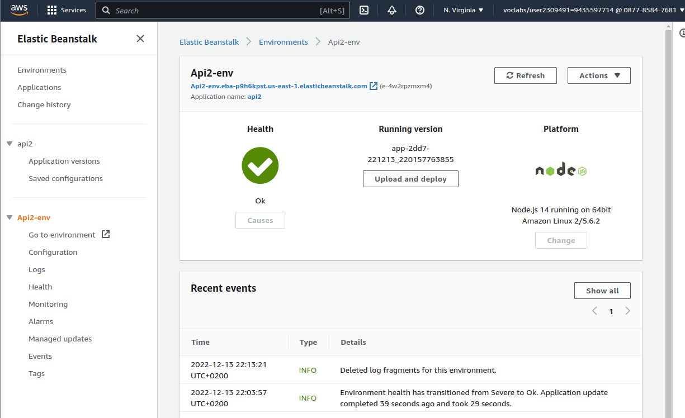
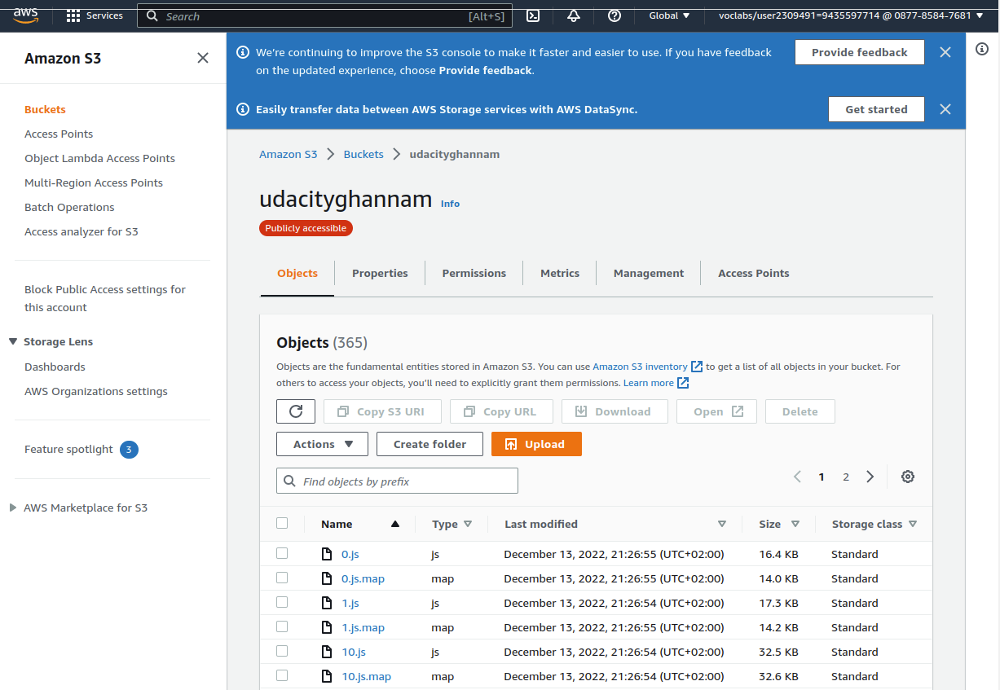
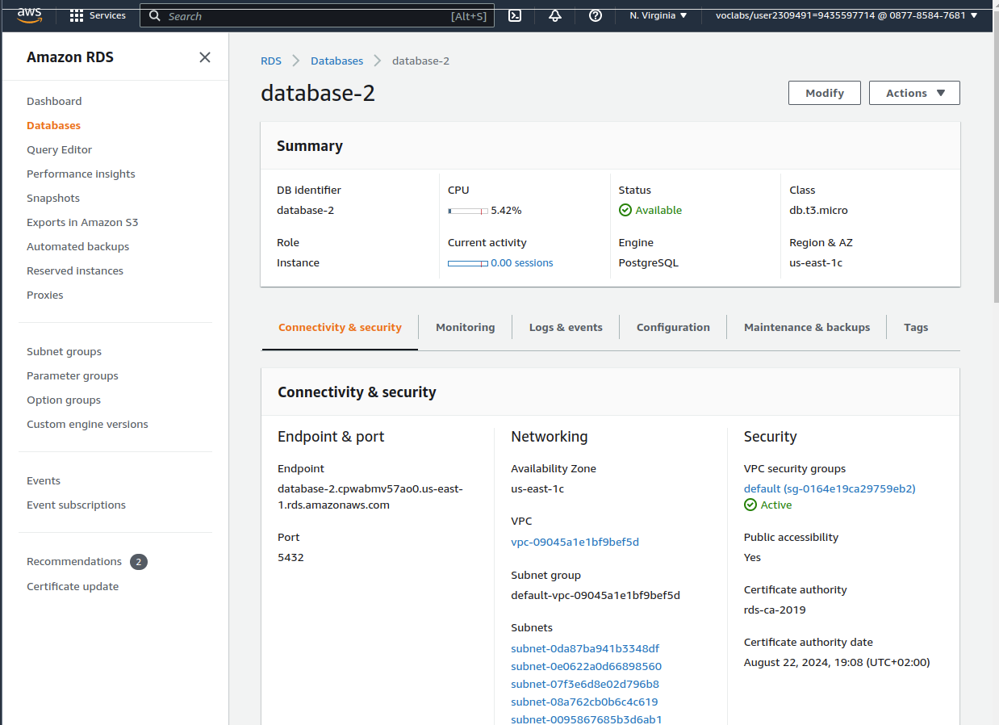
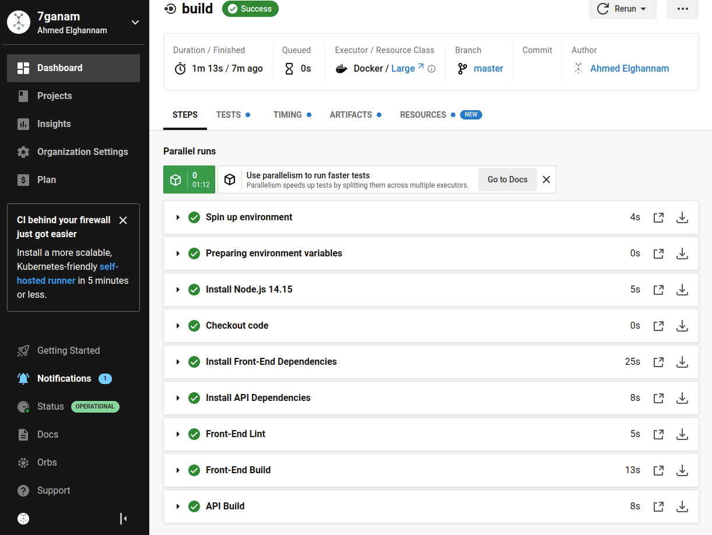
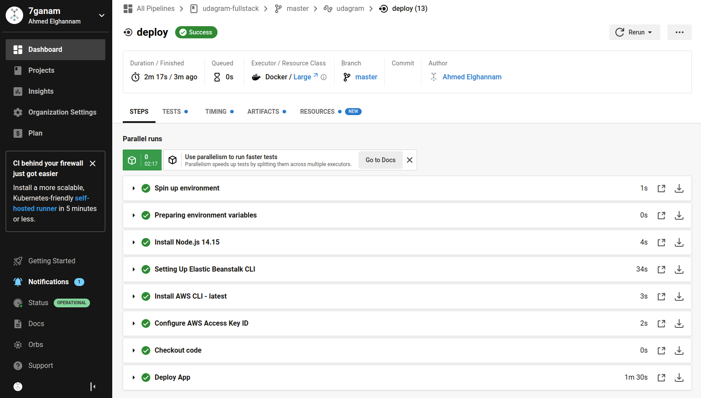
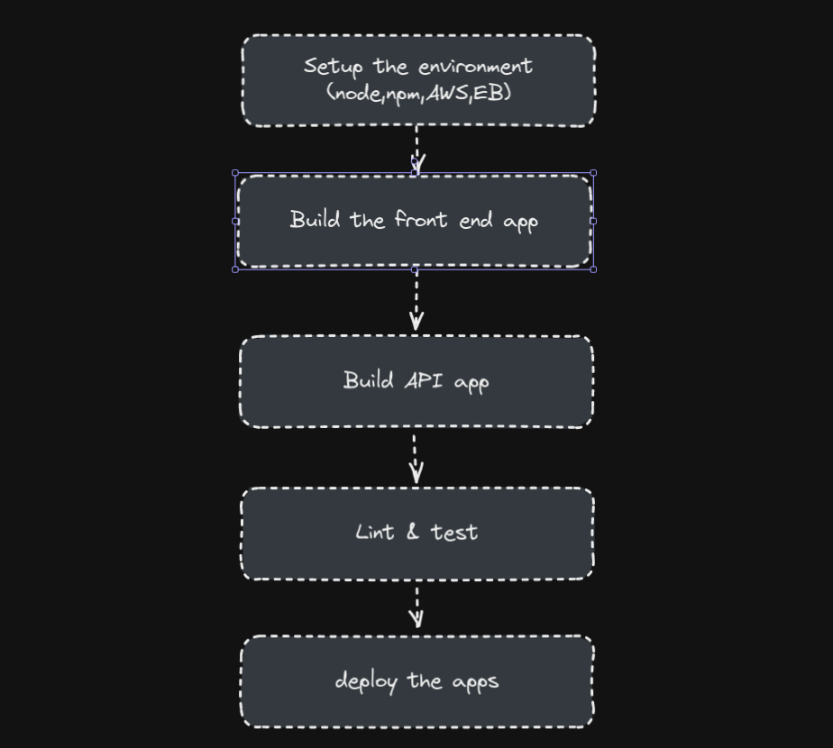
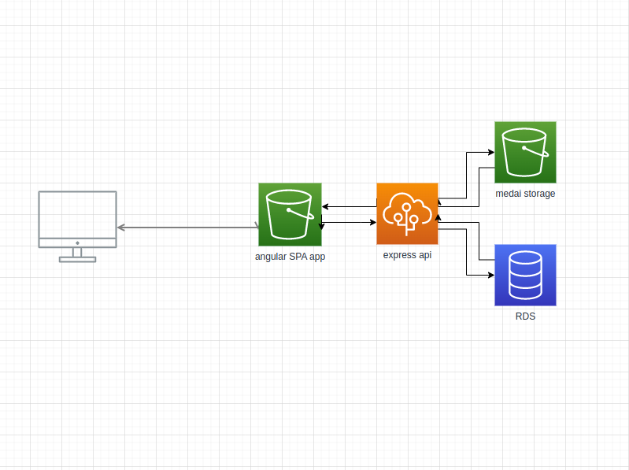

# Udagram

Final project for Udacity advanced web development nanodegree. A full stack web app with Angular and express api. deployed to amazon elastic beanstalk and s3 with an RDS postgres. Integrated CI with circleCI.

Project URL:

http://udacityghannam.s3-website-us-east-1.amazonaws.com/

## Illustration Screenshots

### Elastic Beanstalk configuration

### S3 Bucket

### PostgreSQL RDS database

### CircleCI Pipeline

App Structure

### Architecture

## License

[License](LICENSE.txt)
